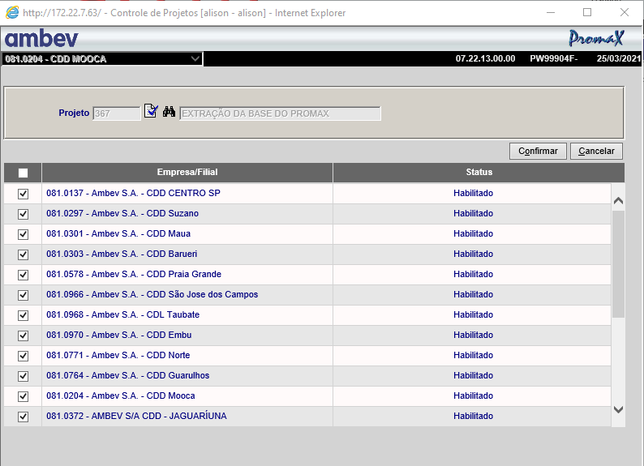
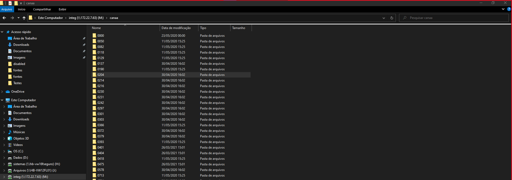
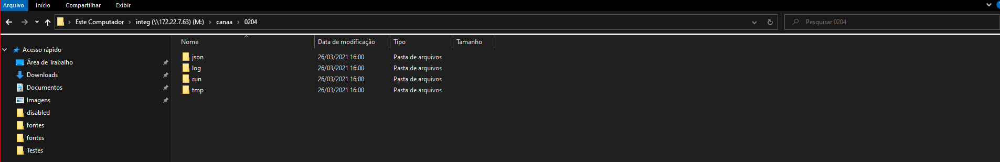

# Resumo da Extração de dados do Promax para projeto Bifrost

Esse é um resumo dos passos realizados para extração de dados do promax, geração do arquivo dump e disponibilização das informações em formato JSON.
Já existem diversos documentos que explicam em maiores detalhes cada parte do processo.

### Configuração dos ambientes

Todas as configurações de ambiente estão detalhadas no link abaixo:

- [Preparação dos ambientes](https://dev.azure.com/AMBEV-SA/AMBEV-BIFROST/_wiki/wikis/Bifrost/2519/Configura%C3%A7%C3%A3o-de-Ambiente)

### Análise das entidades envolvidas

- Após o acionamento de uma função na tela do promax, verificar e definir as entidades de dados(arquivos) que serão extraídas.
- Conferir se as entidades já não foram extraídas por algum processo anterior, isso ajuda a evitar duplicidade de informações.

### Processo de Extração

- Modelando a entidade a partir do layout dos arquivos:

  - [Geração do xls](https://dev.azure.com/AMBEV-SA/AMBEV-BIFROST/_wiki/wikis/Bifrost/2682/Modelando-a-Entidade)

- Gerar documentos para alteração de pontos chave para estrutura de extração de dados:

  - [Code Generator](https://dev.azure.com/AMBEV-SA/AMBEV-BIFROST/_wiki/wikis/Bifrost/2582/Code-Gen-Extra%C3%A7%C3%A3o)
  - [Search and Edit](https://dev.azure.com/AMBEV-SA/AMBEV-BIFROST/_wiki/wikis/Bifrost/2586/Search-and-Edit-Extra%C3%A7%C3%A3o)

- Verificar as configurações do arquivo de filas estão corretas para gerar XML corretamente.

  - [Configurar fila](https://dev.azure.com/AMBEV-SA/AMBEV-BIFROST/_wiki/wikis/Bifrost/806/7-Alterar-CONFIG_CANAA.XML)

- Verificar se o projeto 367 está ativo para a UNB de testes através da tela 07.22.13 do Promax



#### Execução e Gravação do Dump

Após a atualização dos códigos fonte e copybooks no fonte seguro, executar o processo via tela do promax.

Com a nova configuração os arquivos de dump serão gerados em pastas específicas por UNB no ambiente relacionado e configurado para execução do processo.



A estrutura básica é:

```unix
    /ambiente/canaa/[unb]/
```

Nesse endereço encontramos as pastas: json, log, run, tmp.



Quando um processo está em execução, o arquivo de dump pode aparecer temporariamente na pasta temp.

Após finalizado o processo, se for executado sem erros, o arquivo será gravado no diretório run/disabled.
Se houver algum erro, no diretório run/error.

Se todos os processos forem executados com sucesso, será gerado o arquivo no diretório json com as informações já disponíveis em um formato aceito para gravação na base da dados do bifrost.
